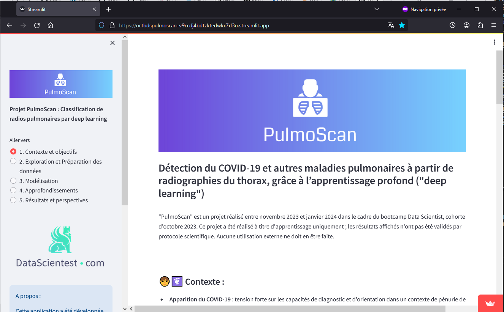
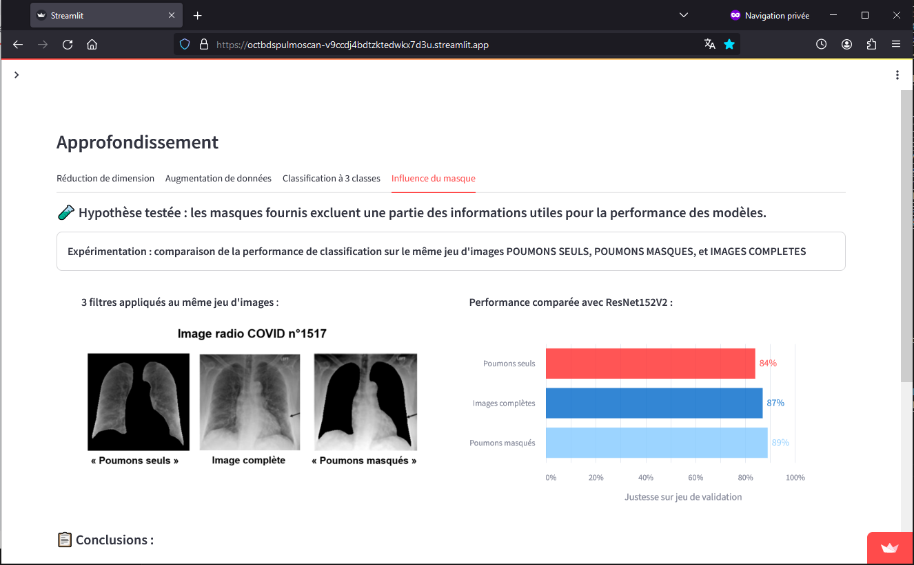
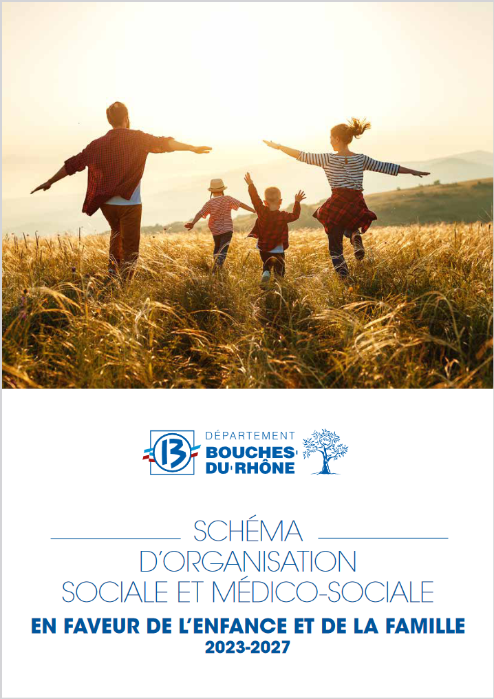
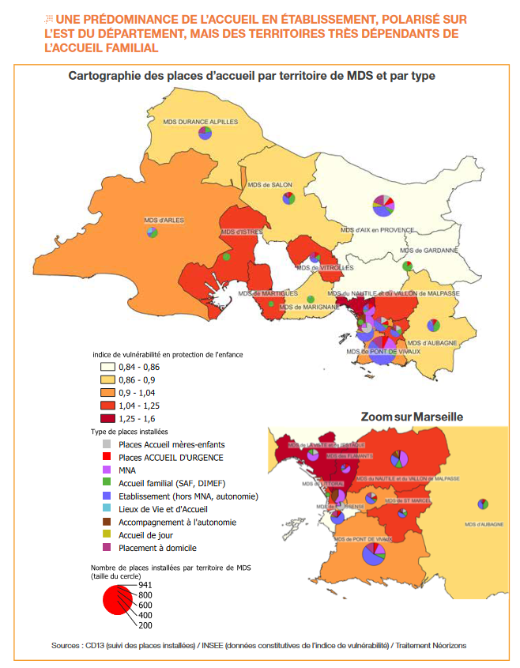

Thibaut Gazagnes, Ingénieur Data Scientist
==========================================

 

         
              
Mon profil en bref 👋 
------------

- Ingénieur des Mines avec 11 ans d'expérience dans la transformation des organisations (30+ acteurs publics et privés en France et en Australie) 
- Certifié Data Scientist début 2024, à l'issue d'une formation de 400h à temps plein avec un organisme leader en France
- En recherche active d'opportunité professionnelle, je souhaite contribuer à mettre la science des données au profit de l'humain et de la planète.

Formation 🌱
------------
- Certification **Data Scientist** (Datascientest 2023)
- Certification Lean Six Sigma "green belt" (Centrale Paris 2014)
- **Ingénieur des Mines de Nancy** (Ecole Nationale Supérieure des Mines de Nancy 2011)

Stack technique 💻 
------------

         
  

            

Mes projets récents 📌
------------

#### **Détection de maladies pulmonaires par deep learning à partir de radiographies du thorax** - [Voir sur Streamlit](https://octbdspulmoscan-v9ccdj4bdtzktedwkx7d3u.streamlit.app/)
- Projet fil rouge réalisé en équipe dans le cadre de la formation Data Scientist
- Techniques mises en oeuvre : Réseaux de neurones convolutionnels, transfer learning, interprétabilité Grad-CAM
- Outils : Python, Kaggle, Colab, OpenCV, Keras, Tensorflow; Github, Streamlit

<table border="0" style="margin: 0 auto;">
  <tr>
    <td align="center">
             
    </td>
    <td align="center">
             
    </td>
  </tr>
</table>

  

#### **Elaboration du Schéma départemental en faveur de l'enfance et de la famille des Bouches-du-Rhône** - [Voir sur le site du Département](https://www.departement13.fr/fileadmin/user_upload/ConseilGeneral/SchemaDepartementaux/Document/schema_enfance_et_famille-062023.pdf)
 - Analyse de données socio-démographiques (INSEE, CAF, DREES, CD13) et cartographie dans le cadre de la réalisation d'une mission de conseil au sein du cabinet [Néorizons](https://www.linkedin.com/company/n%C3%A9orizons/)
 - Outils : Excel, Access, QGIS, Powerpoint, Word

<table border="0" style="margin: 0 auto;">
  <tr>
    <td align="center">
           
    </td>
    <td align="center">
           
    </td>
  </tr>
</table>

------------
💬 Contact : thib<!-- commentaire -->aut.ga<!-- commentaire -->zagnes<!-- commentaire -->@<!-- commentaire -->gmail.com

© 2024 Thibaut Gazagnes. Tous droits réservés.
