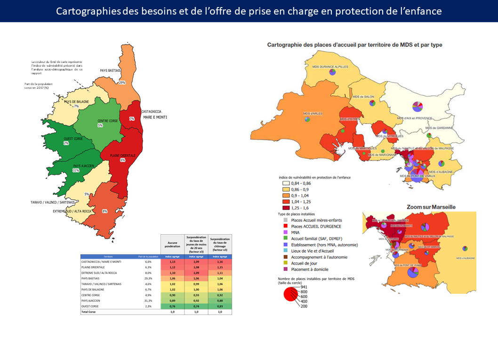
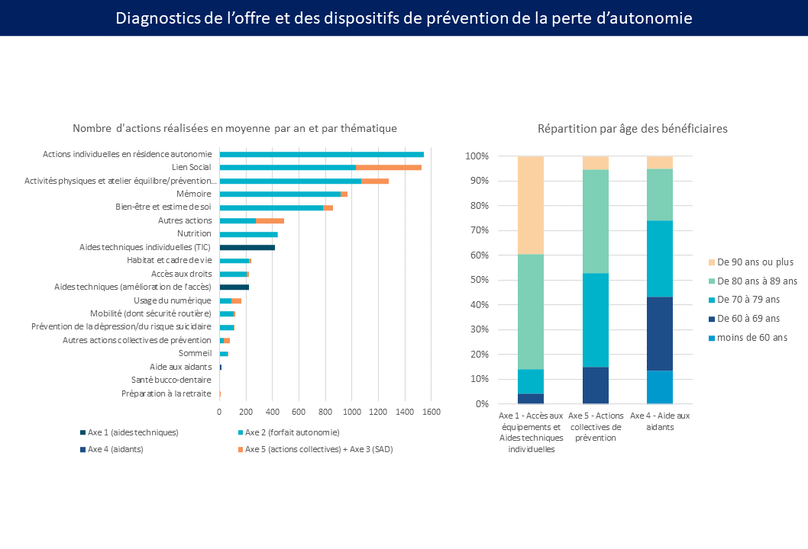
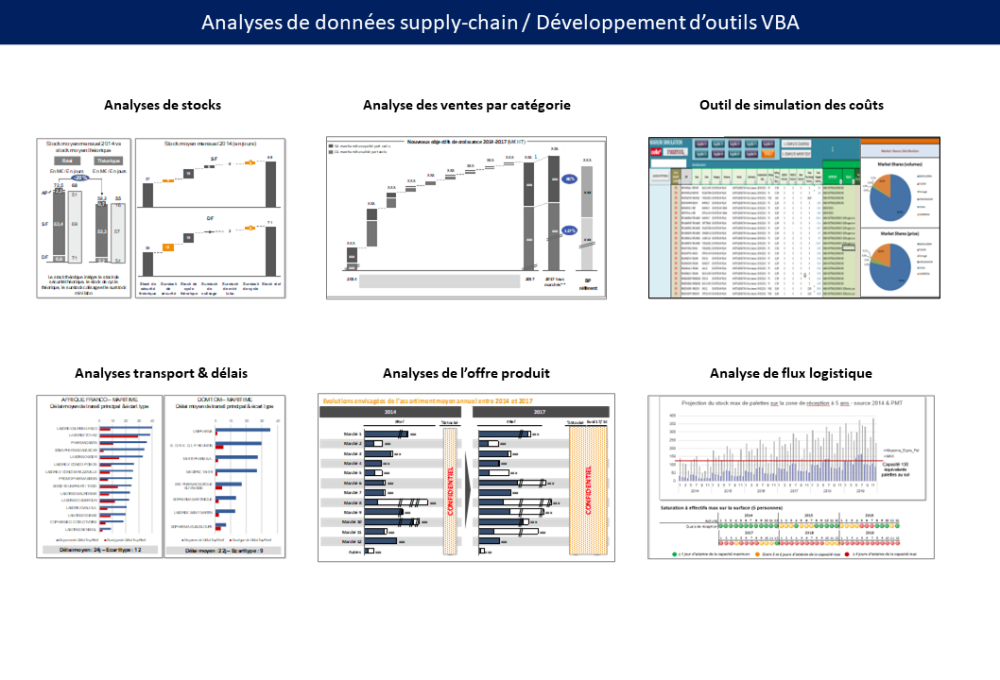

👋 Thibaut Gazagnes, Ingénieur Data Scientist
==========================================
  
Ingénieur des Mines de Nancy, certifié Data Scientist par [Datascientest.com](https://datascientest.com/formation-data-scientist) et Mines ParisTech à l'issue d'une formation de 400 heures à temps plein.
Ex-consultant avec 11 ans d'expérience dans l'analyse et l'accompagnement de projets de transformation (30+ acteurs publics et privés en France et en Australie). 
Je souhaite désormais contribuer aux applications vertueuses de la data et de l'IA. 
 

Formation 🌱
------------
- **Ingénieur des Mines de Nancy** (2008-2011)
-  **Data Scientist** (certification professionnelle par Datascientest - oct. 2023 - janv 2024)

Stack technique 💻 
------------

         
  

  
 
   
  
     

Réalisations data 🧮
------------

#### **2023-2024 : Détection de maladies pulmonaires par deep learning à partir de radiographies du thorax** - [Voir sur Streamlit](https://octbdspulmoscan-v9ccdj4bdtzktedwkx7d3u.streamlit.app/)
- Projet fil rouge réalisé en équipe dans le cadre de la formation Data Scientist (Datascientest.com)
- Techniques et outils mis en oeuvre : Réseaux de neurones convolutionnels, transfer learning, interprétabilité Grad-CAM / Python, Kaggle, Colab, OpenCV, Keras, Tensorflow, Github, Streamlit

<table border="0" style="margin: 0 auto;">
  <tr>
    <td align="center">
             
    </td>
    <td align="center">
             
    </td>
  </tr>
</table>

  

#### **2020-2023 : Pilotage et réalisation de diagnostics des besoins et de l'offre de prise en charge sociale et médico-sociale**
- Analyses et cartographies de données socio-démographiques (INSEE, CAF, DREES) et de données sur l'offre d'accueil et d'accompagnement dans les champs de la **protection de l'enfance**, de la **prévention de la perte d'autonomie** et de la prise en charge des **personnes âgées et personnes en situation de handicap**, dans le cadre de missions réalisées au sein du cabinet [Néorizons](https://www.linkedin.com/company/n%C3%A9orizons/)

<table border="0" style="margin: 0 auto;">
  <tr>
    <td align="center">
           
    </td>
    <td align="center">
           
    </td>

  </tr>
</table>

#### **2012 - 2019 : Analyses de données supply-chain et modélisation de processus / Conduite de projets Lean 6 sigma**
- Analyse et visualisation de données de ventes, volumes, stocks, achats, offre produit/merchandising, dans le cadre de la réalisation de missions de conseils chez Argon Consulting puis de mon rôle de chef de projet Lean chez Kmart Australia
- Développement de tableaux de bord de KPI opérationnels et d'outils VBA (Excel/Access)

<table border="0" style="margin: 0 auto;">
  <tr>
    <td align="center">
           
    </td>
  </tr>
</table>

Contact
------------

   

💬  thib<!-- commentaire -->aut.ga<!-- commentaire -->zagnes<!-- commentaire -->@<!-- commentaire -->gmail.com

© 2024 Thibaut Gazagnes. Tous droits réservés.
